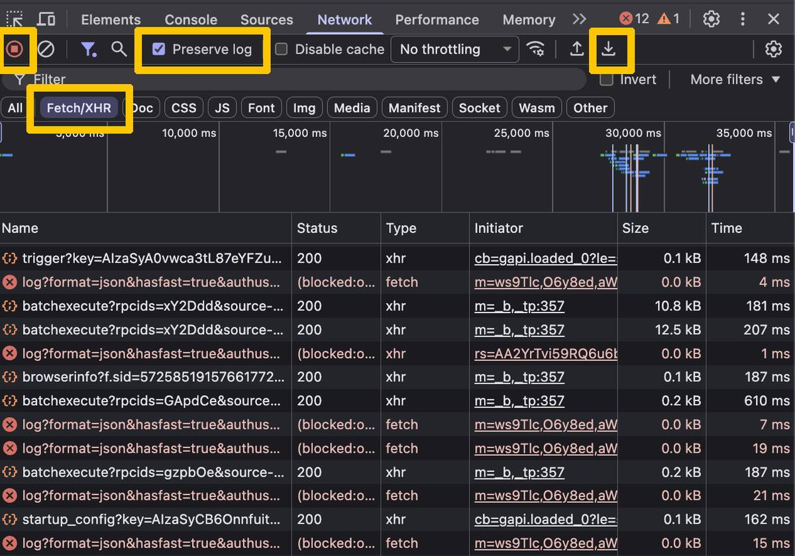

# Contributing

Colombia and Bancolombia are only where this starts. The useful version of
Clatri is one adapter per bank, added by the people who already have a session
there. If yours is missing, that is an invitation.

Your GitHub account is the signature on the pull request. Before you open one,
or when you send it, please email [contacto@gurwi.com](mailto:contacto@gurwi.com).
We want to know who is contributing, talk through the work you have done, and
make sure the intent is good.

Opening the pull request assigns the copyright of that contribution to
**Gurwi LLC**. That is the [Contributor Assignment Agreement](CLA.md). If you
do not agree, do not open the PR. Gurwi owns the rights and may use the work
in Clatri. The public repository stays [GPL-3.0](LICENSE): forks must stay
open. You keep credit as the author in the git history.


## What a contribution looks like

One bank, one pull request.

1. `src/banks/xx-name.js` — a two-letter country code, then the bank, for
   example `mx-bbva.js` or `co-davivienda.js`
2. That file listed in `manifest.json` next to `co-bancolombia.js`
3. The bank's hosts added to every `matches` array in `manifest.json`
4. If the country is new, one entry in `COUNTRIES` inside `src/core/registry.js`

Do not touch `src/core/`, `src/ui/`, or the engine “while you are here”. If the
bank really needs a core change, open a separate issue first. Mixing a new bank
with a refactor is how a bad change hides.

Read `src/banks/co-bancolombia.js` before you write anything. Copy its shape,
not its Bancolombia URLs.

## Record the bank session in DevTools

An AI can write the adapter if it sees the calls the portal already made.
Chrome can record those calls and save them as a file.



1. Sign in to your bank in Chrome.
2. Open DevTools: `F12`, or `Cmd+Option+I` on Mac / `Ctrl+Shift+I` on Windows.
3. Go to the **Network** tab.
4. Confirm recording is on (the round button is red). Click the clear icon if
   the list is already full.
5. Tick **Preserve log** so a page change does not wipe the recording.
6. Filter by **Fetch/XHR**. You do not need images or CSS.
7. In the bank, open your accounts (products) and then movements /
   transactions. Those two calls are the ones that matter.
8. Export: click the ↓ download arrow in the Network toolbar (**Export HAR**),
   or right-click the list → **Save all as HAR with content**. Chrome writes a
   `.har` file.

That file is the recording. Keep it on your machine.

A HAR includes cookies and your session token. Do not attach it to the pull
request, an issue, or an email. To have an AI build the adapter, open the HAR
(or the same requests in Network), copy the **Response** JSON of the accounts
and transactions calls — not the headers — replace your account numbers with
`00000000000`, and paste that into the AI with this repo open.

> Write a Clatri bank adapter in the style of `src/banks/co-bancolombia.js`.
> Register it, add the host to `manifest.json`, and do not change `src/core`
> or `src/ui`.


## Adapter contract

```js
registry.register({
  id: "yourbank",          // lowercase, stable
  country: "MX",           // ISO 3166-1 alpha-2; add it to COUNTRIES if new
  name: "Your Bank",
  currency: "MXN",

  matchesHost: (host) => /(^|\.)yourbank\.com$/i.test(host),
  isApiRequest: (url) => /yourbank\.com/i.test(url) && !/\.(js|css|png|svg)(\?|$)/i.test(url),

  parseAccounts,             // response -> [{ number, name, type, currency, balance }]
  parseTransactions,         // response -> [{ date, description, amount, reference }]
  buildTransactionsRequest,  // { account, from, to, page } -> { url, method, body }
});
```

Use the helpers in `src/core/shape.js`. They find lists by what rows look like,
not by a hardcoded path, and they rewrite dates in whatever layout the bank
already used.

An adapter parses and builds request bodies. It does not call `fetch`,
`sendBeacon`, `WebSocket`, or inject scripts. The engine is the only thing that
talks to the network, and only on the bank host you declared.

## Tests and fixtures

```bash
node test/run.mjs
```

Keep that green. If you add parsing cases, put them in `test/logic.test.mjs`
with invented numbers:

| Use | Do not use |
|---|---|
| `00000000000`, `12345678901` | Your real account |
| `1000000` | Your real balance |
| `"Example merchant"` | Payees from your statement |

The same rule applies to screenshots, comments, and commit messages.

## What gets rejected

- HAR files, `.har` snippets, cookies, `Authorization` values, or live JSON
  with real accounts
- `fetch` / `sendBeacon` / remote scripts inside an adapter
- New Chrome permissions, `host_permissions`, or matches outside the bank
- Minified or obfuscated source
- A PR that changes the engine and adds a bank in the same diff
- A PR from someone who has not emailed [contacto@gurwi.com](mailto:contacto@gurwi.com)
  or who does not accept the [CLA](CLA.md)

Review is a person reading a small diff and asking: does this file only parse
JSON for the host it claims? If yes, it merges. If you would not paste the
payload into a public gist, do not paste it into the PR.

## After it lands

The country and bank pickers pick up any registered adapter. Users still sign
in themselves. Clatri never sees their password and never stores the session.

Questions that are not a patch yet belong in an issue: “I have Nequi / BBVA MX
/ Itau, here is a redacted accounts and transactions JSON.” That is a useful
issue. A screenshot of your home balance is not.
